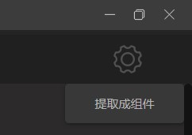
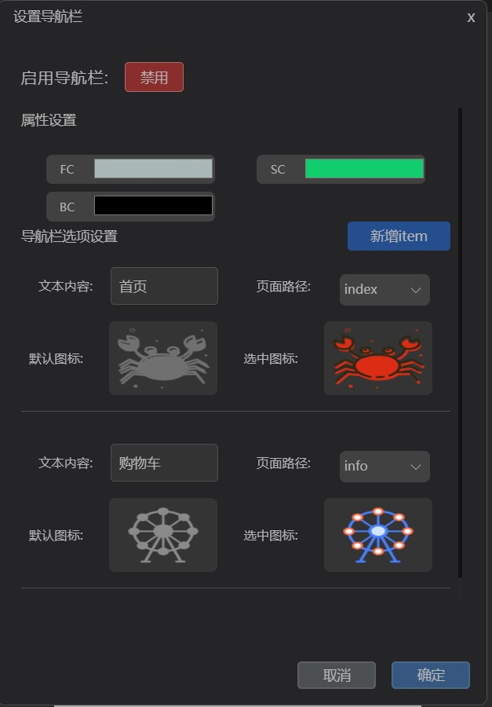

# 进阶技巧
在这里你可以了解到 FerrisGo 提供给你更加进阶的操作，使用它们可以使你的小程序在多个维度上更加丰富。

## 自定义组件
在 FerrisGo 里，我们提供了许多默认组件可供用户搭建页面，但是随着用户需求的增加，
简单的组件已经无法满足用户的开发需求，
所以我们推出了自定义组件的功能，
通过自定义组件用户可以自己封装一个有基础组件构成的新组件，
在日后的开发中用户就可以直接通过封装的自定义组件进行页面构建，
大大减少了用户的心智负担和繁琐工作。

### 封装指引
选中一个你想封装的组件，在右上角可以看到一个小箭头，把鼠标放上去就会弹出下面的封装按钮。

点击提取成组件，你就可以为该组件起一个心仪的名字，随后在左边的组件栏中你就可以看到它了。

## 导航操作
在工作区右上角有一个小齿轮，你可以通过点击那个小齿轮获得一个弹出层，在这里你可以找到导航操作入口按钮。

### 设置导航栏

点击弹出层的导航栏按钮，会弹出一个专属于设置导航栏参数的窗口，
在这里你可以设置导航栏中字体默认颜色以及选中颜色，
并且自由设置导航项目，包括导航栏上的别名，连接的页面，选中图标和默认图标。

::: warning
根据微信小程序官方文档，导航栏的栏目限制最小为2，最高为5。
:::

### 设置路由跳转
在这里你可以给组件设置路由跳转事件，点击后就可以直接跳转到设置的对应目标路由。

::: warning
在设置路由跳转之前，记得要先选中想要点击跳转的组件。

在模拟器中我们将组件的点击事件设置成鼠标中键触发，以防止产生其他冲突，
当然编译成小程序后还是左键触发🤗。
:::

选中组件后，你就可以设置想要跳转的目标路由了，
点击确定后在设置跳转事件的路由上按下鼠标中键就可以跳转了，
使用该操作就可以使小程序的结构更加丰富。