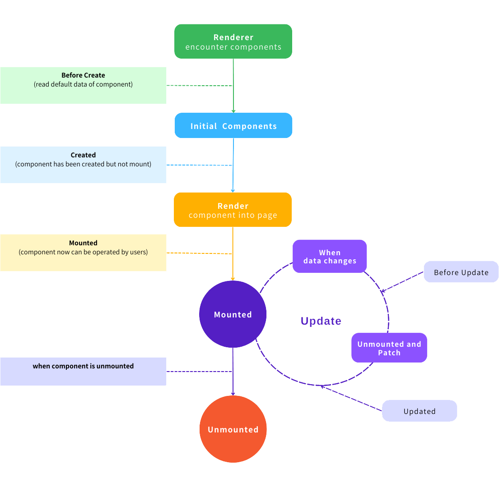

# 深入了解FerrisGo

## 系统架构
FerrisGo  采用的是**MVVM**的架构
用户通过简单的修改数据就可以做到更新页面视图。

## FerrisGo两大核心理念
---

#### 生命周期和响应式系统
这两个系统保证了  FerrisGo  的最底层开发思路，是整个程序的基石。

## 生命周期
每个能够被放置在工作区的组件都有一个生命周期。

<!--  -->

包含**beforeCreate,created，update，mounted,unMounted**五个阶段。

### beforeCreate
在这个阶段，  FerrisGo  会通过虚拟  dom  获取对应元素的对应属性，准备  **create**  元素。

### created
在  created  阶段，元素通过刚刚准备好的数据进行创建元素，虽然元素已经创建好了但是元素在这时还没有真正被渲染到页面上。

### mounted
当程序进行到这个阶段的时候，元素会被  FerrisGo  渲染到页面上，用户可以看到对应元素并修改其数据。

### update
只有创建好的元素的数据被修改时才会进入  update  阶段，在这个阶段首先  FerrisGo  会根据修改后的数据进行更新虚拟dom
然后把对应的元素  unMount  进行卸载操作，卸载后会根据修改后的虚拟  dom  进行  patch  操作，完成  update  这一流程。

### unMounted
unMounted  阶段只有元素被销毁的时候执行，即用户主动删除元素或者  update  操作会执行。

## 响应式系统

FerrisGo暴露给用户四大响应式接口：**Input，File，CheckBox，ListMenu**。

当用户通过以上四个接口之一修改数据的时候就会触发  FerrisGo  的更新系统，达到通过数据操作。
修改页面样式的效果。

## Diff算法

FerrisGo  在更新的过程中要销毁组件并且重新弄渲染，初期我们的更新策略是将页面上所有组件清除并重新渲染
后期发现这种清除然后渲染  HTMLElement  的更新策略其实有很多不必要的操作，  FerrisGo  完全可以只更新我们修改的组件，所以我们引入了  Diff  算法
来靶向更新页面，大大提高了  FerrisGo  的性能。